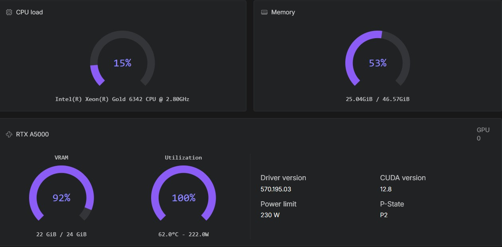

[](https://hub.docker.com/r/ls250824/run-comfyui-minimax)

# 🚀 Run MiniMax with ComfyUI with provisioning — RunPod

## bf16


## fp8



## Workflow i2v


A streamlined and automated environment for running **ComfyUI** with **MiniMax-2.3 video models**, optimized for use on RunPod

## 🔧 Features

- Automatic model and LoRA downloads via environment variables or lora-manager.
- Built-in **authentication** for:
  - ComfyUI
  - Code Server
  - Hugging Face API
  - CivitAI API
- Supports advanced workflows for **video generation** and **enhancement** using pre-installed custom nodes.
- Compatible with high-performance NVIDIA GPUs.

## 🧩 Template Deployment

### Deployment.

- All available templates on runpod are tested on a L40S and RTX A5000.

### Runpod templates

[**👉 One-click Deploy on RunPod MiniMax-2.3**](https://console.runpod.io/deploy?template=p4f6rm9tb4&ref=se4tkc5o)

### Documentation

- [⚙️ Start](https://comfyui.rozenlaan.site/ComfyUI_MiniMax)
- [📚 Tutorial](https://comfyui.rozenlaan.site/ComfyUI_MiniMax_tutorial)
- [⚙️ Provisioning examples](docs/ComfyUI_MiniMax_provisioning.md)

## 🐳 Docker Images

### Base Images

- **PyTorch Runtime**  [](https://hub.docker.com/r/ls250824/pytorch-cuda-ubuntu-runtime)

- **ComfyUI Runtime**  [](https://hub.docker.com/r/ls250824/comfyui-runtime)

### Custom Image

```bash
docker pull ls250824/run-comfyui-minimax:<tag>
```

## 🛠️ Build & Push Docker Image (Optional)

Use the included Python script to build and push the Docker image.

### Build Script: `build_docker.py`

| Argument       | Description                        | Default          |
|----------------|------------------------------------|------------------|
| `--username`   | Your Docker Hub username           | Current user     |
| `--tag`        | Custom image tag                   | Today's date     |
| `--latest`     | Also tag image as `latest`         | Disabled         |

### Example Usage

```bash
git clone https://github.com/jalberty2018/run-comfyui-minimax.git
cp ./run-comfyui-minimax/build_docker.py ..

export DOCKER_BUILDKIT=1
export COMPOSE_DOCKER_CLI_BUILD=1

python3 build_docker.py --username=<your_dockerhub_username> --tag=<custom_tag> --latest run-comfyui-minimax
```
