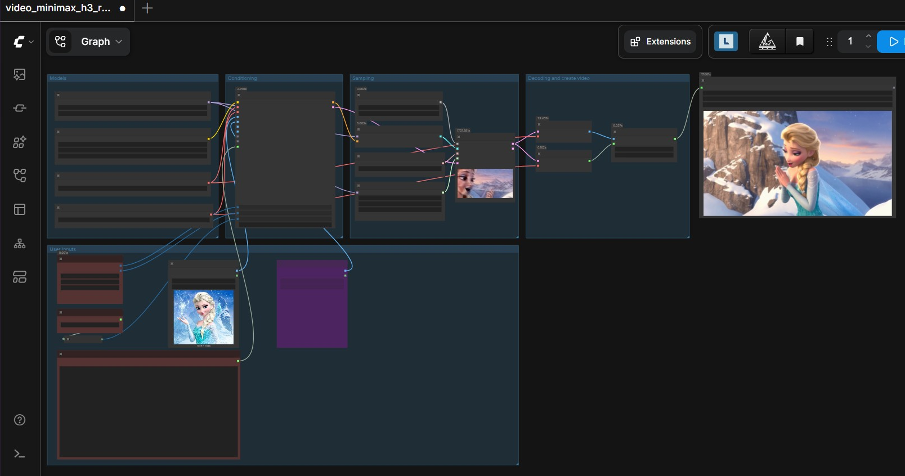
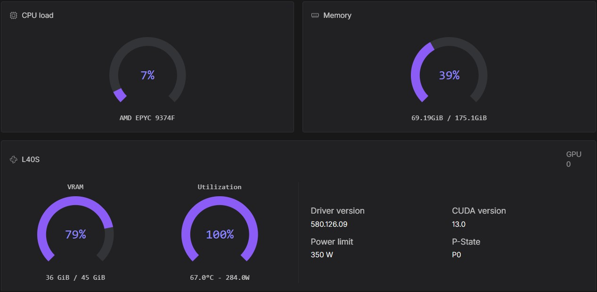

[](https://hub.docker.com/r/ls250824/run-comfyui-minimax)

# 🚀 Run MiniMax with ComfyUI with provisioning — RunPod

## Workflow i2v



A streamlined and automated environment for running **ComfyUI** with **MiniMax H3 video model**, optimized for use on RunPod

## Runpod NVIDIA HVRAM



## 🔧 Features

- Automatic provisioning of models, LoRAs, VAEs, text encoders and workflows.
- Separate model profiles for standard NVIDIA and Blackwell GPUs.
- High- and low-VRAM selection through environment variables.
- Uncensored Heretic text encoder and tail for prompt enhancement.
- CUDA 12.8 runtime with preinstalled attention accelerators and custom nodes.
- ComfyUI, Code Server, LoRA Manager and SSH access.
- Hugging Face and CivitAI token support.
- Multiple Turbo LoRAs, including 4-step and 8-step variants.
- MiniMax H3 Prompt Enhancer with isolated local GGUF inference through the
  CUDA-enabled `llama-server` included in `comfyui-runtime2`.

## 🧩 Template Deployment

### Deployment

- The provisioning profiles target RTX 3090, L40S, RTX 5090 and RTX PRO 6000 GPUs.

## Tested configurations

| Provisioning | GPU | Model | Purpose | Pod RAM | Tested output |
|---|---|---|---|---:|---|
| NVIDIA LVRAM | RTX 3090 24 GB | Pruned INT8 ConvRot | Lowest cost and maximum compatibility | 50 GB | 0.9 MP, 15 seconds |
| NVIDIA HVRAM | L40S 48 GB | Full INT8 ConvRot | Quality and longer video | 80 GB | 0.9 MP, 20 seconds, 24 fps |
| Blackwell LVRAM | RTX 5090 32 GB | Pruned INT8 ConvRot | Compatible low-VRAM profile for Blackwell | 70 GB | 1.0 MP, 15 seconds, 24 fps |
| Blackwell HVRAM | RTX PRO 6000 96 GB | Full MXFP8 (FP8 scaled) | Maximum quality and speed | 70 GB | 2 MP, 15 seconds, 24 fps |

### Runpod templates

- [**👉 One-click Deploy on RunPod MiniMax H3 FL2VA  **](https://console.runpod.io/deploy?template=v7b5g03csk&ref=se4tkc5o)
- [**👉 One-click Deploy on RunPod MiniMax H3 Ref2VA **](https://console.runpod.io/deploy?template=6qtfx7lxgc&ref=se4tkc5o)

### Documentation

- [⚙️ Start](https://comfyui.rozenlaan.site/ComfyUI_MiniMax)
- [📚 Tutorial](https://comfyui.rozenlaan.site/ComfyUI_MiniMax_tutorial)
- [⚙️ Provisioning examples](docs/ComfyUI_MiniMax_provisioning.md)

## 🐳 Docker Images

### Base Images

- **PyTorch Runtime**  [](https://hub.docker.com/r/ls250824/pytorch-cuda-ubuntu-runtime)

- **ComfyUI Runtime**  [](https://hub.docker.com/r/ls250824/comfyui-runtime2)

### Custom Image

```bash
docker pull ls250824/run-comfyui-minimax:<tag>
```

## 🛠️ Build & Push Docker Image (Optional)

Use the included Python script to build and push the Docker image.

### Build Script: `build_docker.py`

| Argument       | Description                        | Default          |
|----------------|------------------------------------|------------------|
| `--username`   | Your Docker Hub username           | Current user     |
| `--tag`        | Custom image tag                   | Today's date     |
| `--latest`     | Also tag image as `latest`         | Disabled         |

### Example Usage

```bash
git clone https://github.com/jalberty2018/run-comfyui-minimax.git
cp ./run-comfyui-minimax/build_docker.py ..

export DOCKER_BUILDKIT=1
export COMPOSE_DOCKER_CLI_BUILD=1

python3 build_docker.py --username=<your_dockerhub_username> --tag=<custom_tag> --latest run-comfyui-minimax
```

## License

Original code, scripts, configuration and documentation in this repository are
licensed under the [MIT License](LICENSE), except where otherwise noted.
Third-party software and model weights retain their own licenses; MIT does not
apply to the complete assembled Docker image. See
[Third-party notices](THIRD_PARTY_NOTICES.md).

### Model usage and responsibility

Model weights are downloaded separately, including automatically through the
user's provisioning settings. Users must review model licenses and applicable
restrictions before deployment and are responsible for their inputs, use and
sharing of generated content. See
[Model usage and responsibility](docs/MODEL_RESPONSIBILITY.md).
